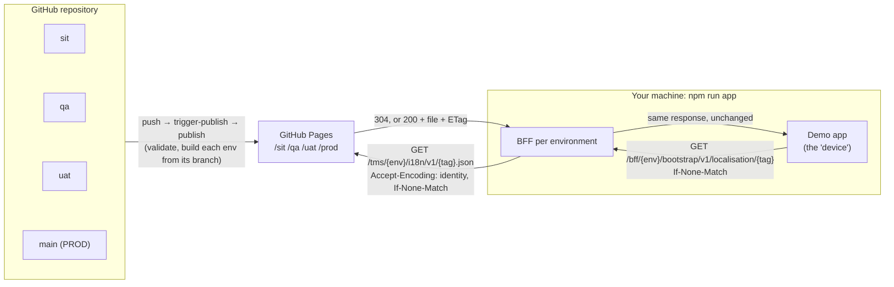

# TMS locale delivery: proof of concept

Translation (locale) files for the app, managed in **one GitHub repository** with **one branch per environment**. A GitHub Actions workflow publishes them to **GitHub Pages**. The app on the device gets them through a **bootstrap BFF** that uses ETags, so a device downloads a file only when it has changed. The BFF has two ETag modes: it passes GitHub's ETag through (the default), or it uses a hash of the file's content (see [ETag modes](#etag-modes)).

This is **Strategy 1** (one repository, one site) with **option B** (BFF → GitHub Pages directly, no Azure Front Door). The design is in `localisation-tms/tsd-changes/`: `azure-front-door-etag-caching.md` and `environments-strategy-1-single-site.md`.

---

## What this demonstrates

| Question | What you see in the demo |
|---|---|
| How do SIT, QA, UAT and PROD keep separate content in one repository? | Each environment is a branch (`sit`, `qa`, `uat`, `main`) published to its own folder. A change to SIT shows up in SIT only, until it is promoted. |
| How does a change move between environments? | `add-key` adds a key in SIT. `promote` moves it to QA, then UAT, then PROD with merge commits. The app shows it arriving in each environment. |
| How does a device know whether its locale file changed? | The app shows the ETag it sent and the ETag received: **304** when nothing changed (0 bytes), **200** when it did, with a key-by-key diff of what changed. |
| Does the BFF have to compute or store anything? | No, in the default mode. It forwards `If-None-Match` to GitHub Pages and passes back 304 or 200 with GitHub's ETag unchanged. The app's animated **Data flow** view plays each hop of a real call. |
| Does a SIT publish make PROD devices download again? | With GitHub's ETag, yes: every deploy gives every file a new ETag, so the device gets **200 · new ETag, same content**. With the **content hash** ETag, no: the same PROD launch gets **304**. Switch the **ETag** control to compare. |
| What stops bad content reaching an environment? | The `validate` check runs on every PR and push, and again at publish. It checks file names, journey structure, completeness against `en-US`, placeholders and HTML. |
| Can a non-PROD publish accidentally change PROD? | No. The publish workflow refuses to deploy if PROD's files would change while `main` didn't. |
| How is a new market enabled per environment? | `pt-PT` is published in SIT, and only SIT's BFF allowlists it. PROD's BFF returns 400 without calling GitHub. |
| What does the device show while it has nothing, or the BFF is down? | It renders from the compiled base file (`en-US`, or `fr-FR` for French tags) and keeps its cached file on any error. |

---

## Get started

**You need:** Node.js 20 or later and Git. There are no npm dependencies, so there is no `npm install`.

```sh
git clone https://github.com/Programm3r/tms.git
cd tms
npm run app
```

Open **http://localhost:8090**. (Use `PORT=9000 npm run app`, or `$env:PORT=9000; npm run app` in PowerShell, if 8090 is taken.)

1. The app launches **SIT / en-US** and shows **200 · first download**: the file and its ETag are now in the device cache (your browser's `localStorage`).
2. Press **Launch app** again: **304 · not modified**, 0 bytes. GitHub answered the ETag check, and the BFF passed it through.
3. Switch the environment to **PROD**. The *Get my PUK* button reads **Request PUK** in PROD, because SIT's wording change hasn't been promoted.
4. With PROD selected, choose **pt-PT**: **400**, because pt-PT isn't on PROD's allowlist. The screen falls back to the compiled base file; the dotted underline marks those strings.
5. Tick **Show keys** to see the i18next key under every string.

For a version with no browser, run `npm run showcase`. It plays through the same scenarios in the terminal against the live site.

To change content (`add-key`, `promote`), you need **write access to the repository**. See the [walkthrough](#demo-walkthrough).

---

## How the demo works



1. **Content** lives in `i18n/<tag>.json` on each environment branch, structured by journey (`kmn`, `puk`).
2. **Publishing:**
   - A push that changes `i18n/` on any environment branch starts the `publish` workflow, which always runs from `main`.
   - `publish` checks out all four branches, validates them, and builds `/<env>/i18n/v1/<tag>.json`, adding `_meta` with the commit and its time.
   - It deploys everything to GitHub Pages in one go.
3. **Delivery:** the demo app plays the device. On each launch it makes one conditional GET to its environment's BFF. The BFF forwards it to GitHub Pages and passes the answer back unchanged.

| Environment | Branch | Published folder | BFF in the demo app |
|---|---|---|---|
| SIT | `sit` | https://programm3r.github.io/tms/sit/i18n/v1/ | http://localhost:8090/bff/sit/… |
| QA | `qa` | https://programm3r.github.io/tms/qa/i18n/v1/ | http://localhost:8090/bff/qa/… |
| UAT | `uat` | https://programm3r.github.io/tms/uat/i18n/v1/ | http://localhost:8090/bff/uat/… |
| PROD | `main` | https://programm3r.github.io/tms/prod/i18n/v1/ | http://localhost:8090/bff/prod/… |

https://programm3r.github.io/tms/ lists which commit each environment currently serves.

---

## Demo walkthrough

**Starting state:**
- `main`, `uat` and `qa` contain `en-US`, `fr-FR` and `fr-CI`.
- `sit` additionally has **`pt-PT`** (a new market) and en-US *"Get my PUK"* instead of *"Request PUK"*.
- No environment has `puk.section.help-link` yet. That's the red key under the button on the phone.

**Before you start:** with the app open, launch **SIT / fr-CI** and **PROD / fr-CI** once each, so both are cached on the "device". Then switch **ETag** to **Content hash (BFF)** and launch **PROD / fr-CI** again, so PROD is cached in both modes. Switch back to **GitHub's (pass-through)**.

### 1. Add a new key in SIT

```sh
npm run add-key -- --direct          # or: npm run add-key  → prints a PR link; merge with "Squash and merge"
```

1. The script adds `puk.section.help-link` to **every** locale file on `sit`, validates, and pushes. Run it again later and it **rewords** the key in every language instead. Use that for step 2, or any time you want another visible change.
2. `trigger-publish` runs on `sit` and starts `publish` from `main` (https://github.com/Programm3r/tms/actions). After about a minute, the **SIT** card at the top of the app shows the new commit.
3. **SIT / fr-CI → Launch app:**
   - **200 · content updated**, with *ETag received* different from *If-None-Match sent*.
   - **What changed:** `NEW puk.section.help-link`.
   - The new string is highlighted on the phone.
4. **Launch app** again: **304 · not modified**, 0 bytes.
5. **PROD / fr-CI → Launch app:** the key is still red, because PROD is unaffected. Expect **200 · new ETag, same content**: GitHub redeployed the whole site, which gives PROD's files new ETags, but their content is identical. See [ETag note](#etag-note-every-publish-changes-every-etag).
6. Switch **ETag** to **Content hash (BFF)**, then **PROD / fr-CI → Launch app:** **304 · not modified**, 0 bytes. *GitHub's ETag (BFF only)* shows **changed**: the BFF fetched the file again, but its hash is the same, so the device downloads nothing.

### 2. Change an existing value

```sh
npm run add-key -- --key puk.section.request-puk --value fr-CI="Recevoir mon PUK" --direct
```

After it publishes, **SIT / fr-CI → Launch app** shows **CHANGED** `puk.section.request-puk: "Obtenir mon code PUK" → "Recevoir mon PUK"`. Other languages keep their values.

### 3. See validation block a bad change

- `npm run add-key -- --key puk.section.x --value en-US="<b>Hi</b>" --value fr-FR=Salut --value fr-CI=Salut --value pt-PT=Olá` stops before committing: *value contains HTML*.
- Leaving a language out also stops it: *no --value for fr-CI*.
- On GitHub, a PR into `sit` that removes a key or adds HTML fails the `validate` check, with an annotation on the file.

### 4. Promote SIT → QA → UAT → PROD

```sh
npm run promote -- sit qa --direct   # or without --direct: prints the PR link; merge with "Create a merge commit"
```

1. The script lists the commits and locale changes that will move up, then merges with a merge commit and pushes.
2. After publishing, switch the app to **QA**: the new key and wording arrive with **200 · content updated**.
3. **QA / pt-PT** still returns **400**: the file is now published in QA, but QA's BFF allowlist doesn't include `pt-PT`. Publishing content and enabling a market are deliberately separate. Add `pt-PT` to `qa.tags` in `bff/config.json` and restart the app to enable it.
4. `npm run promote -- qa uat --direct`, then `npm run promote -- uat main --direct`. When `main` changes, the publish summary shows PROD as **changed** and the PROD check is skipped, because PROD content is meant to change.
5. **PROD / fr-CI → Launch app:** **200 · content updated**, and the key is no longer red.

### 5. Hotfix

Branch from `main`, open a PR into `main`, and merge. Then back-merge `main → uat`, `uat → qa` and `qa → sit` with PRs, so the next promotion doesn't undo the fix.

---

## The demo app

`npm run app` serves the app and runs all four BFFs on one origin (`demo/app-server.mjs`).

| Area | What it shows |
|---|---|
| **Environment cards** (top) | The commit each environment serves on GitHub Pages, its files, and its BFF allowlist. Click a card to switch environment. |
| **Phone** | The PUK and Know-my-number screens rendered from the locale data. **Highlighted:** just changed. **Dotted underline:** from the compiled base file. **Red key name:** the key doesn't exist in this environment. *Show keys* adds the key under every string. |
| **Last launch** | The status in plain words, the ETag sent and received (decoded into file time and size), bytes downloaded, the BFF's call to GitHub, and GitHub's CDN result. Statuses: **200 first download**, **304 not modified**, **200 content updated**, **200 new ETag, same content**, **400/404/502**. In content-hash mode it also shows GitHub's ETag as the BFF saw it, and whether it changed since the BFF last fetched. **200 new hash, same keys** means only `_meta` changed, because the environment's branch moved on. |
| **Data flow for this call** | An animated view of the selected call across four blocks: device app, BFF, GitHub CDN edge and GitHub Pages origin. Each request (over the top, blue) and response (underneath, green, or red for errors) travels between the blocks as a labelled packet, e.g. `GET fr-CI · If-None-Match "6abe…"`. The block that acts lights up and shows what it did:<br/>• the device's cache lookup;<br/>• the BFF's allowlist check and the upstream request it built;<br/>• a CDN cache hit (which edge server, how old) or a miss that goes on to the origin;<br/>• *pass through unchanged, store nothing*;<br/>• what the device did with the answer.<br/>Blocks the call never reaches are greyed out. Replay, pause, step (◀ ▶) and speed controls sit above it. Click a row in *Request history* to replay another call. |
| **What changed** | Keys added, changed (old → new) or removed since the previous cached version. |
| **Device cache** | The stored ETag, `_meta.commitId` and `publishedAt`, and whether that commit is still what the site serves. |
| **Request history** | Every launch: ETag sent, status, ETag received, bytes, CDN result. |
| **All keys** | Every key and value in the active content, filterable, with new and changed keys flagged. |

**Controls:**
- **Launch app:** renders from the cache first, then makes one conditional GET.
- **ETag:** **GitHub's (pass-through)** or **Content hash (BFF)**. Each mode has its own device cache, so switching modes doesn't make the device download again, and you can compare both on the same file. The demo app server lets the app pick the mode per request; a real BFF has one mode, set in `bff/config.json`.
- **Auto-check:** repeats the launch every 15 seconds.
- **Clear device cache:** forgets the file and ETag for this environment and language. The next launch is a 200 with the full file. GitHub's CDN can still answer it from its own cache, so the origin isn't necessarily contacted.
- **Bypass GitHub CDN** (demo only): the BFF asks GitHub for a path variant with extra slashes, e.g. `/tms/sit///i18n/v1//fr-CI.json`.
  - **Why it works:** GitHub's CDN hasn't cached that variant, so it fetches from the **origin**, which ignores the extra slashes and serves the same file and ETag. The origin block lights up in the data flow.
  - **Why it's needed:** query strings and `Cache-Control: no-cache` don't bypass GitHub's CDN.
  - **Caution:** this is undocumented GitHub behaviour. The BFF only honours it when the demo app server enables it; the real BFF must never use it.

> In the real app, new content is kept pending and applied at the next journey mount. The demo applies it immediately, so you can see it.

---

## Scripts

| Command | What it does |
|---|---|
| `npm run app` | Demo app and BFFs on http://localhost:8090 |
| `npm run add-key [-- --direct] [--dry-run]` | The demo key `puk.section.help-link` on `sit`. **If `sit` doesn't have it yet, it's added** in every language. **If it's already there, every language switches to a different wording at random**, so each run is a visible content change. Validates, commits on a `content/…` branch, then pushes it for a PR, or squash-merges into `sit` and pushes (`--direct`). `--dry-run` shows and validates the change, then discards it. |
| `npm run add-key -- --key <journey.path> --value <tag>="…" [--value …] [--env sit\|qa\|uat\|prod] [--direct]` | Adds or changes any key. A new key needs a value for every locale file on that branch. |
| `npm run promote -- <sit qa \| qa uat \| uat main> [--direct]` | Shows what will be promoted, then prints the PR link or merges with a merge commit and pushes. |
| `npm run validate` | Runs the content rules on `i18n/` |
| `npm run showcase` | Plays through nine option B scenarios against the live site in the terminal |
| `npm run bff [-- --etag-mode content]` | Starts the four BFFs on ports 8081–8084 for `curl` or `demo/device.mjs`, with the ETag mode from `bff/config.json` unless `--etag-mode` overrides it |
| `node demo/device.mjs --env sit --tag fr-CI [--reset]` | A command-line device: one launch, prints the status, ETag and a value |

`add-key` and `promote` refuse to run with uncommitted changes, and always switch back to the branch you were on.

### What `npm run showcase` checks

| # | Scenario | Expected |
|---|---|---|
| 1 | First launch on SIT (`fr-CI`), empty device cache | 200, file stored with its ETag |
| 2 | Next launch with `If-None-Match` | 304, 0 bytes: GitHub answered, the BFF passed it through |
| 3 | ETag at GitHub Pages vs at the device | Identical |
| 4 | gzip vs identity ETag at GitHub Pages | Different, which is why the BFF fixes the encoding |
| 5 | `puk:section.request-puk` (en-US) in SIT, QA, UAT, PROD | SIT differs until promoted |
| 6 | `pt-PT` on SIT vs PROD | 200 vs 400 (per-environment allowlist) |
| 7 | Allowlisted tag with no published file | BFF's own 404 JSON, no GitHub HTML, no ETag |
| 8 | `puk:section.refresh` vs `kmn:section.refresh` | Resolved independently (journeys are namespaces) |
| 9 | Content-hash mode on PROD (`fr-CI`): first launch, next launch, then a new BFF that has nothing stored | 200 with the file's SHA-256 as the ETag, then 304, then 304 again although the new BFF fetched the whole file from GitHub |

---

## How publishing works


- **Always from `main`.** `trigger-publish` only starts `publish` from `main`. An unreviewed workflow change on `sit` can therefore never deploy PROD.
- **Every run rebuilds all four environments from their branch heads.** If two pushes land close together, the newer queued run replaces the older one. Nothing is lost: the newer run publishes both changes.
- **Rebuilds are deterministic.** `_meta.publishedAt` is the commit time of the branch head, not the build time, so rebuilding an unchanged branch gives byte-identical files.
- **PROD check.** If `main` didn't change, every PROD file must be byte-identical to the live file. Otherwise the deploy stops.
- **No CDN purge (option B).** GitHub clears its own CDN on every Pages deploy. GitHub sends `Cache-Control: max-age=600`.
- **The `verify` job summary** lists every published file with:
  - its ETag, decoded into file time and size;
  - the response to a conditional request (304);
  - the gzip ETag. It differs from the uncompressed one, which is why the BFF always sends `Accept-Encoding: identity`.

### Branch rules

- **Promotions use merge commits only (never squash or rebase).** Squashing makes the branch histories drift apart, and every later promotion then conflicts.
- **Content PRs into `sit` are squash-merged.**
- **Hotfixes go into `main`** and are back-merged down.
- **`validate` should be a required check on all four branches.** All environments deploy together, so an invalid file on any branch blocks every environment.

---

## Repository layout (the same on every branch)

```
i18n/                     source locale files, one per language tag, structured by journey
  en-US.json              English source: the reference for completeness
  fr-FR.json, fr-CI.json
  pt-PT.json              on sit only, until promoted
scripts/                  used by the workflows
  validate.mjs            content rules
  build-site.mjs          builds out/<env>/… from each branch, adds _meta and version.json
  compare-live.mjs        finds changed environments; PROD check
  verify-live.mjs         after deploy: waits for the new commits, records ETags and 304 behaviour
  lib/                    shared helpers
bff/
  bff.mjs                 the pass-through BFF (option B)
  server.mjs              the four BFFs on ports 8081–8084
  config.json             repository, site URL, per-environment allowlists
demo/
  app/, app-server.mjs    the demo app
  add-key.mjs, promote.mjs content changes and promotions
  device.mjs, showcase.mjs command-line device and scenario run
.github/
  workflows/              validate, trigger-publish, publish
  CODEOWNERS, pull_request_template.md
```

---

## Setting it up in another repository

1. Push all four branches (`main`, `uat`, `qa`, `sit`).
2. Update `repo` and `siteUrl` in `bff/config.json`.
3. **Actions:** *Settings → Actions → General → Allow all actions and reusable workflows*.
4. **Pages:** *Settings → Pages → Source:* **GitHub Actions**.
5. **Restrict deploys:** *Settings → Environments → `github-pages` → Deployment branches*: **`main` only**.
6. **First publish:** *Actions → publish → Run workflow* (branch `main`). After that, every push that changes `i18n/` publishes automatically.
7. **Recommended rulesets** (*Settings → Rules → Rulesets*) for `sit`, `qa`, `uat` and `main`:
   - require a PR;
   - require the status check **`validate`**;
   - merge methods: squash on `sit`, merge commit only elsewhere;
   - block force pushes.
8. Optional: make **`sit`** the default branch so contributors' PRs target it. Publishing always runs from `main` regardless.

---

## ETag note: every publish changes every ETag

GitHub Pages builds the ETag from the file's **modification time and size**, and it sets the modification time itself, **at deployment**.
- **Effect:** every publish, even a SIT-only one, gives every file in every environment a new ETag.
- **Content is unaffected:** QA, UAT and PROD files are byte-identical (the PROD check enforces it).
- **Cost:** each device downloads its file once more after any publish. The app shows this as **outdated → changed** and **200 · new ETag, same content**.

**Tested, and it doesn't fix this (2026-10-01):** the `PRESERVE_MTIME=true` repository variable makes `build-site.mjs` set each environment's file times to its branch's commit time. GitHub Pages ignores the uploaded file times:

| Time | What happened |
|---|---|
| 15:36:18–19 | build wrote the files |
| 15:36:35–41 | `deploy-pages` ran |
| **15:36:37** | the file time in every live ETag |

Leave the variable unset. Only these avoid the extra downloads:
- **Separate sites (Strategy 2):** a SIT publish can't touch PROD's files.
- **Content-hash ETags:** the BFF's `content` mode, below. It changes the "ETag passed through unchanged" design.

**Observation (2026-10-01):** GitHub once returned `"689c7eee-386e"` for `pages.github.com`, and then `"689c7eef-386e"` on a dozen later requests. The likely cause is two GitHub origin copies with file times one second apart.
- **Effect if it happens:** a device's ETag doesn't match the copy that answers, so it gets a 200 instead of a 304. That costs a few KB. In content-hash mode only the BFF downloads again; the device still gets a 304.
- **What it can't do:** serve stale content.

### ETag modes

Set `etagMode` in `bff/config.json`, at the top level or per environment.

| | `github` (default) | `content` |
|---|---|---|
| ETag the device gets | GitHub's, unchanged: `"<file time>-<size>"` | `"sha256-<first 128 bits of the SHA-256 of the file>"` |
| Changes when | Any publish, of any environment | This file's bytes change |
| Who answers the device's `If-None-Match` | GitHub's CDN, forwarded by the BFF | The BFF, by comparing it with the hash |
| BFF → GitHub | Conditional, with the device's ETag | Conditional, with the GitHub ETag the BFF stored last time |
| What the BFF keeps | Nothing | Per tag: GitHub's ETag, the hash and the body (a few KB, in memory). If that memory is lost, the next request fetches the whole file from GitHub once. The device still gets a 304 if its hash matches. |
| Gzip vs identity ETags | Matter: the BFF fixes `Accept-Encoding: identity` | Don't matter to the device |

**What happens after a publish that didn't change this file** (e.g. PROD after a SIT-only publish):
1. The device sends its hash in `If-None-Match`.
2. The BFF asks GitHub with the GitHub ETag it stored. The deploy gave the file a new GitHub ETag, so **GitHub sends the BFF the whole file (200)**, although its content didn't change.
3. The BFF hashes it. The hash equals the device's, so **the BFF answers the device with a 304**, not GitHub. The device downloads nothing.
4. The BFF stores GitHub's new ETag. Until the next deploy, GitHub answers the BFF with a 304 and the BFF uses its stored hash.

**Content-hash mode limitations:**
- **The BFF still downloads every file once after every deploy.** Each BFF instance downloads each language it serves, even when the file didn't change. Every instance does this separately, after scaling out or a restart, because the stored ETags are in memory. The saving is in device downloads, not in BFF → GitHub traffic, which is about instances × languages × ~3.5 KB per deploy.
- **The BFF is no longer a pure pass-through.** It keeps state, computes hashes and answers the 304 itself. GitHub's 304 only reaches the BFF.
- **If GitHub's ETag flips between origin copies** (observation above), the BFF downloads the file on each flip. Devices still get a 304.
- **Switching an environment's mode makes every device download its file once.** The device's stored ETag is the other kind, so it doesn't match.
- **`_meta` holds the environment's branch head commit.** Any commit on a branch therefore changes the bytes, and so the hash, of every locale file in that environment, even if only one language changed. Other environments are unaffected. If you want a hash to change only when that language changes, build `_meta` from the last commit that touched each file (`git log -1 -- i18n/<tag>.json`).

---

## Limitations of this POC

- **All four environment folders are public,** including unreleased SIT, QA and UAT wording.
- **The BFFs run locally inside the demo app.** In a real deployment each environment's BFF runs in that environment, with its own site URL and allowlist in its configuration.
- **The "compiled base files" come from the local `i18n/en-US.json` and `fr-FR.json`.** In the real app they are compiled into the binary.
- **GitHub Pages limits apply:** 1 GB per site, a soft 100 GB of bandwidth per month, and terms that discourage using it as the backend of a commercial service.
