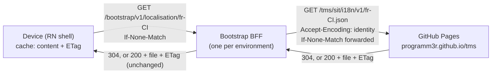
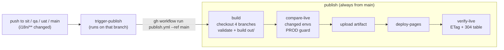

# TMS locale files: POC (Strategy 1, option B)

A proof of concept for publishing translation (locale) files per environment from **one GitHub repository** to **one GitHub Pages site**. The files are served to devices through a **pass-through bootstrap BFF** (option B: no Azure Front Door).

What it demonstrates:

- **A branch per environment, a folder per environment in the published site.** `sit`, `qa`, `uat` and `main` (PROD) each publish to their own folder and can't affect each other.
- **One publish workflow** that rebuilds every environment from its own branch, refuses to change PROD unless `main` changed, and deploys everything as a single Pages artifact.
- **ETag revalidation end to end.** The device sends `If-None-Match`, the BFF forwards it unchanged, and GitHub's CDN answers 304 or 200. The ETag the device holds is GitHub's, unchanged. The BFF computes nothing and stores nothing.
- **The TSD content rules:**
  - file name = language tag;
  - journeys as top-level objects (i18next namespaces);
  - every locale complete against `en-US`;
  - matching placeholders;
  - no HTML;
  - `_meta` added at publish.

Design documents: `localisation-tms/tsd-changes/azure-front-door-etag-caching.md` and `environments-strategy-1-single-site.md`.

---

## Architecture



| Environment | Branch | Published folder | Local BFF |
|---|---|---|---|
| SIT | `sit` | https://programm3r.github.io/tms/sit/i18n/v1/ | http://localhost:8081 |
| QA | `qa` | https://programm3r.github.io/tms/qa/i18n/v1/ | http://localhost:8082 |
| UAT | `uat` | https://programm3r.github.io/tms/uat/i18n/v1/ | http://localhost:8083 |
| PROD | `main` | https://programm3r.github.io/tms/prod/i18n/v1/ | http://localhost:8084 |

An overview of what each environment serves is at https://programm3r.github.io/tms/.

## Repository layout (the same on every branch)

```
i18n/                     source locale files, one per language tag, structured by journey
  en-US.json              English source (complete, the reference for completeness)
  fr-FR.json
  fr-CI.json
  pt-PT.json              only on sit at first: a new market that hasn't been promoted yet
scripts/
  validate.mjs            content rules (PR check)
  build-site.mjs          builds out/<env>/... from each branch, adds _meta and version.json
  compare-live.mjs        finds changed environments; PROD guard
  verify-live.mjs         after deploy: waits for the new commits, records ETags and 304 behaviour
  lib/                    shared helpers
bff/
  bff.mjs                 the pass-through BFF (option B)
  server.mjs              runs it locally, one port per environment
  config.json             site URL and per-environment tag allowlists
demo/
  app/                    browser front end: phone screen + ETag, status, diff, cache, history
  app-server.mjs          serves the front end and hosts all four BFFs on http://localhost:8090
  add-key.mjs             adds or changes a key in every locale file on a branch (PR or direct)
  promote.mjs             promotes sit → qa → uat → main with a merge commit (PR or direct)
  device.mjs              command-line device simulator
  showcase.mjs            plays through the option B scenarios end to end
.github/workflows/
  validate.yml            required check on every branch
  trigger-publish.yml     on a push to any environment branch, starts publish.yml from main
  publish.yml             build → compare → deploy → verify
```

The scripts need Node 20 or later and have no dependencies, so there is no `npm install`.

---

## One-time GitHub setup

1. **Enable Pages:** *Settings → Pages → Build and deployment → Source:* **GitHub Actions**.
2. **Restrict Pages deploys to `main`:** *Settings → Environments → `github-pages` → Deployment branches and tags*. Allow **`main` only**. `publish.yml` always runs from `main`, and also refuses to run from any other branch.
3. **First publish:** *Actions → publish → Run workflow* (branch `main`). After this, every push to an environment branch publishes automatically.
4. **Recommended rulesets** (*Settings → Rules → Rulesets*), one per branch, targeting `sit`, `qa`, `uat` and `main`:
   - Require a pull request before merging.
   - Require status check **`validate`**.
   - Allowed merge methods: **squash** on `sit`; **merge commit only** on `qa`, `uat` and `main`. Squashing a promotion makes the branch histories drift apart, and every later promotion conflicts.
   - Block force pushes.
5. Optional: set the default branch to **`sit`** (*Settings → General*) so contributors' PRs target it automatically. Publishing is unaffected, because it always runs from `main`.

---

## How publishing works



- **Every run rebuilds all four environments from their branch heads.** If two pushes land close together, the newer queued run replaces the older one. Nothing is lost: the newer run publishes both changes.
- **`_meta.publishedAt` is the commit time of the branch head, not the build time.** Rebuilding an unchanged branch therefore gives byte-identical files.
- **PROD guard:** if `main` didn't change, every PROD file must be byte-identical to the live file. If a workflow or script change would alter PROD anyway, the deploy stops.
- **No CDN purge (option B):** GitHub clears its own CDN on every Pages deploy. GitHub sends `Cache-Control: max-age=600`.
- **The `verify` job summary** lists every published file with:
  - its ETag, decoded into file modification time and size;
  - the response to a conditional request (`304`);
  - the gzip ETag, which differs from the uncompressed one. That difference is why the BFF always asks for `Accept-Encoding: identity`.

---

## The demo app (front end)

```sh
cd C:\Dev\tms
npm run app                              # http://localhost:8090  (PORT=xxxx to change)
```

The page behaves like the app on a device:

- **Phone screen:** the PUK and Know-my-number screens, rendered from the locale data. *Show keys* shows the i18next key under every string.
  - Strings that just changed are highlighted.
  - Strings taken from the compiled base file have a dotted underline.
  - Keys that don't exist yet in that environment show in red as the key name, e.g. `puk:section.help-link` until you add it.
- **Environment and Language pickers, *Launch app*:**
  1. Renders immediately from the device cache (the browser's `localStorage`), or from the compiled base file if nothing is cached.
  2. Then makes one conditional GET to that environment's BFF.
  - *Auto-check* repeats this every 15 seconds. *Clear device cache* forgets the file and ETag.
- **Last launch:** the status, with what it means:
  - **200 first download**
  - **304 not modified**
  - **200 content updated**
  - **200 new ETag, same content**: the site was redeployed for another environment
  - **400 / 404 / 502**

  It also shows the ETag sent, the ETag received (decoded into file time and size), bytes downloaded, and GitHub's CDN result.
- **What changed:** keys added, changed or removed compared with the previous cached version.
- **Device cache:** the stored ETag and `_meta.commitId`, and whether that matches what the site serves now.
- **Request history** and **All keys**, with new and changed keys flagged.
- **The environment cards at the top** show which commit each environment serves on GitHub Pages and each BFF's allowlist. Click a card to switch environment.

## Scripts that change content the way a team would

```sh
npm run add-key                          # adds puk.section.help-link to every locale file on sit → prints a PR link
npm run add-key -- --direct              # same, but squash-merged into sit and pushed (fast demo)
npm run add-key -- --key puk.section.request-puk --value en-US="Get PUK now" --env sit --direct
                                         # changes an existing value (other locales keep theirs)

npm run promote -- sit qa                # prints the promotion PR link (merge with "Create a merge commit")
npm run promote -- sit qa --direct       # merges sit into qa with --no-ff and pushes
npm run promote -- qa uat --direct
npm run promote -- uat main --direct     # PROD
```

**What `add-key` does:**
1. Creates `content/<key>-<id>` from the environment branch.
2. Writes the value into **every** locale file on that branch. The completeness check requires this.
3. Runs the same validation as CI, then commits.
4. Then either pushes the branch for a PR, or squash-merges it into the environment branch and pushes (`--direct`).

**What `promote` does:** shows the commits and locale changes that would move up, then either prints the PR link or merges with a merge commit (`--direct`).

Both scripts refuse to run with uncommitted changes, and switch back to the branch you were on.

## Run it from the command line

```sh
cd C:\Dev\tms

npm run validate                         # content rules on i18n/
npm run showcase                         # end-to-end option B scenarios against the live site

npm run bff                              # all four BFFs on 8081-8084 (Ctrl+C to stop)
node demo/device.mjs --env sit --tag fr-CI --reset    # first launch: 200, stored with its ETag
node demo/device.mjs --env sit --tag fr-CI            # next launch: 304, no body
node demo/device.mjs --env prod --tag pt-PT           # 400: pt-PT isn't on PROD's allowlist
```

Or call the BFF directly:

```sh
curl -i http://localhost:8081/bootstrap/v1/localisation/fr-CI
curl -i http://localhost:8081/bootstrap/v1/localisation/fr-CI -H 'If-None-Match: "<etag from above>"'
```

The BFF logs one line per request, showing the upstream status and GitHub's CDN cache result (`x-cache`).

### What `npm run showcase` shows

| # | Scenario | Expected |
|---|---|---|
| 1 | First launch on SIT (`fr-CI`), empty device cache | 200, file stored with its ETag |
| 2 | Next launch with `If-None-Match` | 304, 0 bytes: GitHub answered, the BFF passed it through |
| 3 | ETag at GitHub Pages vs at the device | Identical |
| 4 | gzip vs identity ETag at GitHub Pages | Different, which is why the BFF fixes the encoding |
| 5 | `puk:section.request-puk` (en-US) in SIT, QA, UAT, PROD | SIT differs until promoted |
| 6 | `pt-PT` on SIT vs PROD | 200 vs 400 (per-environment allowlist) |
| 7 | Allowlisted tag with no published file | BFF's own 404 JSON, no GitHub HTML, no ETag |
| 8 | `puk:section.refresh` vs `kmn:section.refresh` | Resolved independently (journeys are namespaces) |

---

## Demo walkthrough

**Starting state:**
- `main`, `uat` and `qa` contain `en-US`, `fr-FR` and `fr-CI`.
- `sit` is one commit ahead:
  - it adds **`pt-PT`**, a new market;
  - it changes the en-US value of `puk.section.request-puk` from "Request PUK" to "Get my PUK".

Start the app (`npm run app`), open http://localhost:8090 and press **Launch app** once for **SIT / fr-CI** and once for **PROD / fr-CI**. Each gets a first download, so both are cached. The red `puk:section.help-link` under the button shows the key doesn't exist anywhere yet.

### 1. Add a new key in SIT

1. `npm run add-key` (PR: open the printed link and **Squash and merge**), or `npm run add-key -- --direct`.
2. `trigger-publish` runs on `sit` and starts `publish` from `main` (https://github.com/Programm3r/tms/actions). About a minute later, the SIT card at the top of the app shows the new commit.
3. **SIT / fr-CI → Launch app:**
   - **Last launch:** **200 · content updated**, with a different ETag received from the one sent.
   - **What changed:** `NEW puk.section.help-link`.
   - **Phone:** the new string is highlighted.
   - **Launch again:** **304 · not modified**, 0 bytes.
4. **PROD / fr-CI → Launch app:** **200 · new ETag, same content**. GitHub redeployed the whole site, so PROD's ETags changed, but its content didn't. The key is still red in PROD. See *ETag note* below.

### 2. Change an existing value

```sh
npm run add-key -- --key puk.section.request-puk --value fr-CI="Recevoir mon PUK" --direct
```

After publishing, **SIT / fr-CI → Launch app** shows **CHANGED** `puk.section.request-puk: "Obtenir mon code PUK" → "Recevoir mon PUK"`.

### 3. See the validation block a bad change

Open a PR into `sit` that removes a key from `fr-CI.json`, or adds `<b>` to a value. `validate` fails, with an annotation on the file. `add-key` runs the same check locally and refuses to commit.

### 4. Promote SIT → QA → UAT → PROD

1. `npm run promote -- sit qa` lists the commits and locale changes that will move up, and prints the PR link. Merge it with **Create a merge commit**. Or add `--direct`.
2. After publishing, **QA** has the new key and wording, and `pt-PT.json`. Switch the app to QA to see the update.
3. **QA / pt-PT** still returns **400**: the file is published, but QA's BFF allowlist doesn't include `pt-PT`. Content and market enablement are deliberately separate. Add `pt-PT` to `qa.tags` in `bff/config.json` and restart the app to enable it.
4. `npm run promote -- qa uat`, then `npm run promote -- uat main`. When `main` changes, the publish summary shows PROD as **changed** and the guard is skipped. That's expected: PROD content is meant to change.
5. **PROD / fr-CI → Launch app:** **200 · content updated**, and the new key appears in PROD.

### 5. Hotfix

Branch from `main`, open a PR into `main`, and merge. Then back-merge with PRs `main → uat`, `uat → qa` and `qa → sit`, so the next promotion doesn't undo the fix.

---

## ETag note and optional experiment

GitHub Pages builds the ETag from the file's **modification time and size**. Every deploy rewrites every file, so a SIT publish also gives PROD's files new ETags. The content is identical, but PROD devices download their file once more. This is harmless, but wasteful.

**Experiment:** set the repository variable **`PRESERVE_MTIME=true`** (*Settings → Secrets and variables → Actions → Variables*).
- `build-site.mjs` then sets each environment's file times to its branch head's commit time.
- `compare-live.mjs` fails a deploy whose new commit time isn't later than the live one, because that could publish new content with an old ETag.

Publish a SIT-only change and compare PROD's ETags in two consecutive `verify` summaries. If they stay the same, GitHub Pages keeps the artifact's file times, and the fix works.

**Observation (2026-10-01):** GitHub returned the uncompressed ETag `"689c7eee-386e"` for `pages.github.com` once, and `"689c7eef-386e"` on a dozen later requests across different edge servers. The likely cause is GitHub's origin copies holding file times one second apart.
- **Effect if it happens:** a device sends one copy's ETag and the request reaches another copy, so it gets a 200 instead of a 304. That costs a few KB.
- **What it can't do:** serve stale content, because a mismatch always returns the current file.
- **How to watch for it:** compare the ETags shown in the `verify` summary across runs.

---

## Limitations of this POC

- **All four environment folders are public**, including unreleased SIT, QA and UAT wording.
- **The BFFs run locally.** In a real deployment each environment's BFF would run in its own environment with `I18N_SITE_URL` and its allowlist set in its configuration.
- **`demo/device.mjs` uses `i18n/en-US.json` and `i18n/fr-FR.json` as the "compiled base files"**, which in the real app are compiled into the binary.
- **GitHub Pages limits apply:** 1 GB site, a soft 100 GB/month of bandwidth, and terms that discourage using it as the backend of a commercial service.
